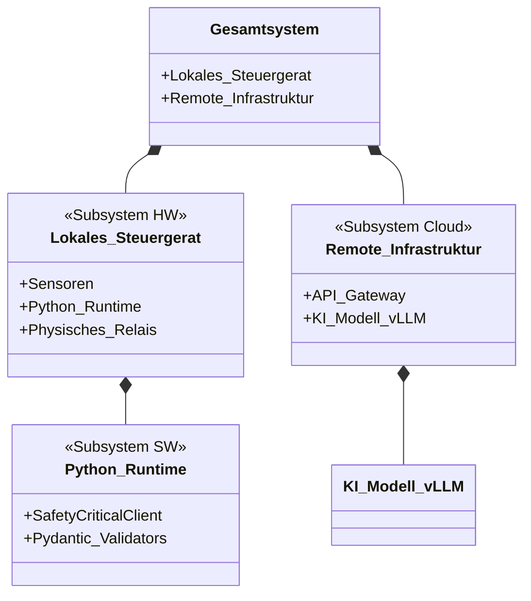
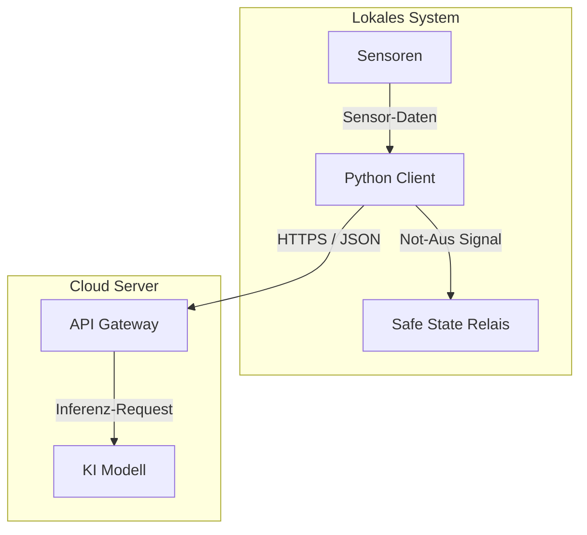
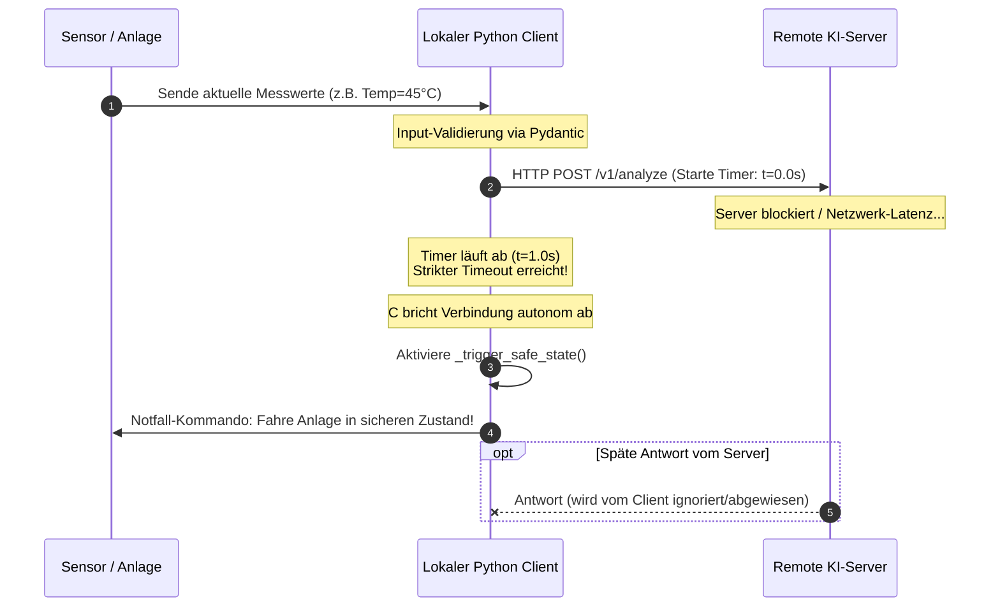
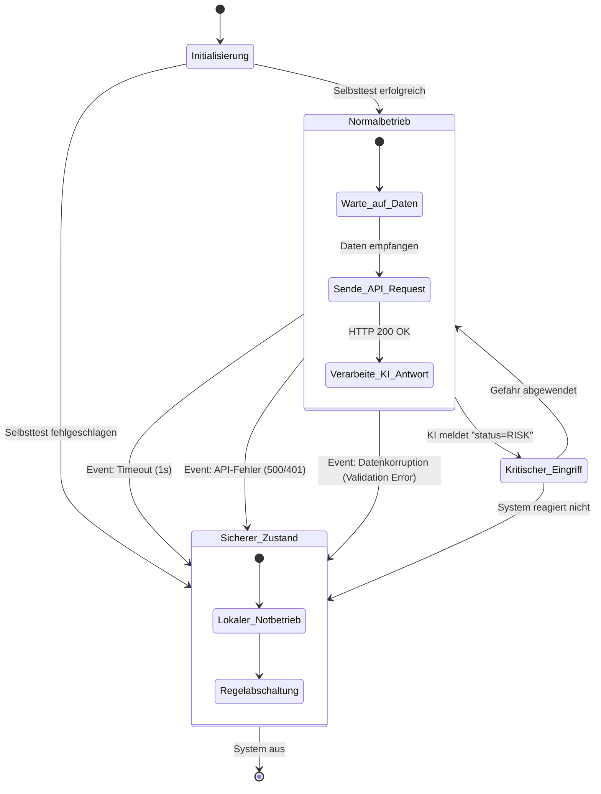

# Systemdokumentation
## 1. Klassendiagramm (Automatisch aus Quellcode generiert)

## 2. Internes Blockdiagramm (Signalfluss)

## 3. Sequenzdiagramm (Timeout & Fallback)

## 4. Zustandsdiagramm (Safety States)

